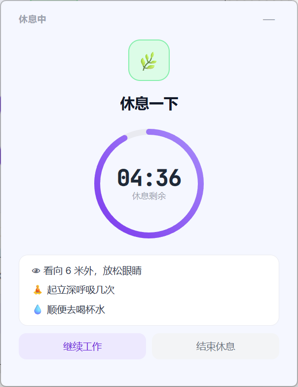
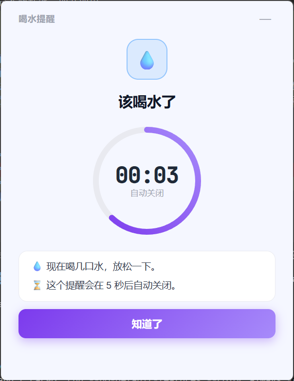
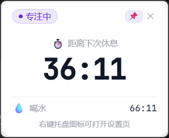

# 歇会儿 (Take a Break)

“歇会儿”是一款简单、轻量、便携的定时提醒软件，专为久坐人群设计。无论是提醒喝水、还是提醒起身休息，它都能安静地在后台运行，并在需要时给你温馨的提示。

一切从简，没有冗余的功能，即开即用。

## 软件截图

<table>
  <tr>
    <td align="center"><b>休息一下</b></td>
    <td align="center"><b>该喝水了</b></td>
    <td align="center"><b>小窗口提示</b></td>
  </tr>
  <tr>
    <td></td>
    <td></td>
    <td></td>
  </tr>
</table>

## 核心功能

- 🧘 **久坐提醒**：自定义提醒间隔（如 15~120 分钟），到点提醒起身活动。
- 💧 **喝水提醒**：独立倒计时，养成随时补充水分的好习惯。
- 📌 **悬浮状态窗**：支持固定在桌面，实时查看剩余时间，带有贴心的状态徽章指示。

## 特性

- 🎈 **轻量化**：资源占用低，后台静默运行不打扰。
- 📦 **便携版**：无需复杂的安装配置，轻松携带，数据保存在程序目录下。
- ⏱️ **简单易用**：专注于核心提醒功能，没有多余的干扰。

## 技术栈

本项目基于以下技术构建：
- [Tauri](https://tauri.app/) - 用于构建跨平台桌面应用的轻量级框架
- [Vue 3](https://vuejs.org/) - 前端渐进式框架
- [Element Plus](https://element-plus.org/) - 基于 Vue 3 的组件库 (按需引入)
- [Vite](https://vitejs.dev/) - 下一代前端构建工具

## 开发指南

确保你已经安装了 [Node.js](https://nodejs.org/)、[pnpm](https://pnpm.io/) 以及 [Rust 运行环境](https://www.rust-lang.org/tools/install)。

### 1. 安装依赖

```bash
pnpm install
```

### 2. 启动开发环境

```bash
pnpm tauri dev
```

## 构建说明

如果需要构建用于分发的应用程序包，可以运行以下命令：

```bash
# 快速自检 Rust 后端代码 (在 src-tauri 目录下)
cargo check

# 完整构建 Tauri 应用 (不打包，生成可执行文件)
pnpm tauri build --no-bundle
```
